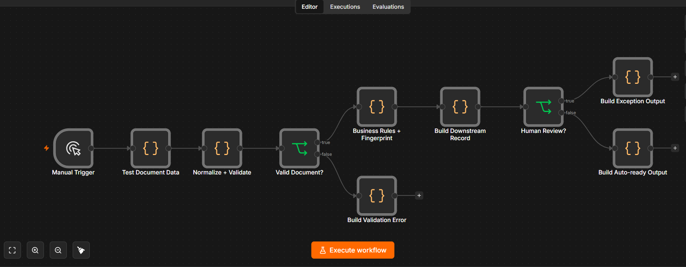
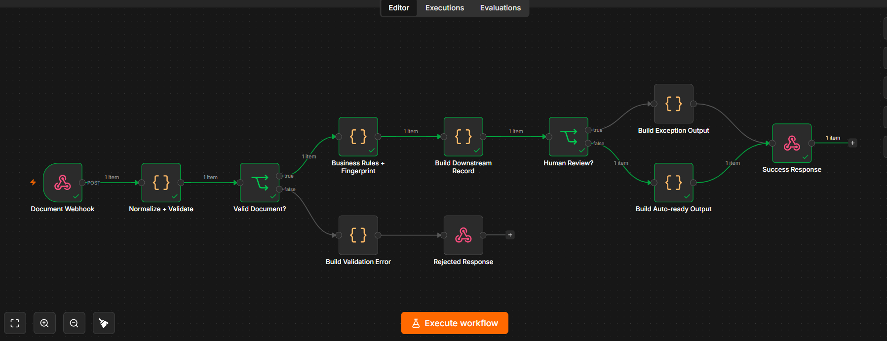
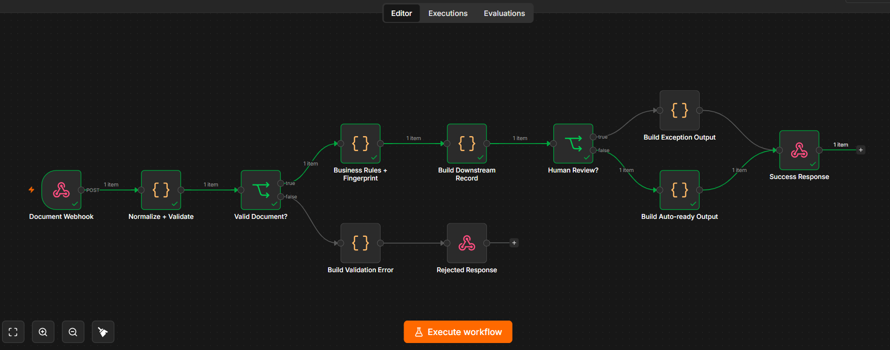
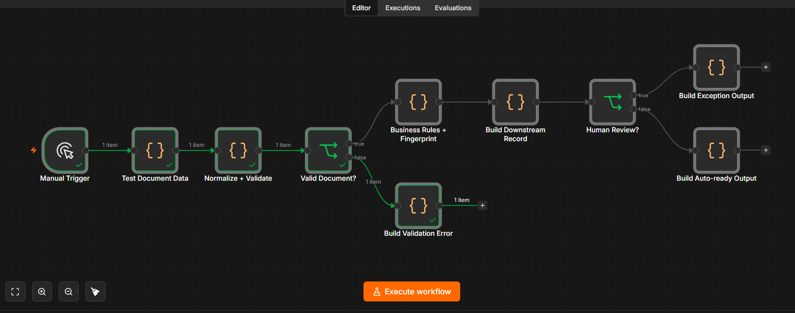

# Intelligent Document Operations

> Production-minded portfolio reference implementation for document intake, structured field validation, business-rule checks, exception routing, and downstream-ready records.

**Author:** Tetiana Shtemberh  
**Role:** AI Automation & Implementation Specialist  
**Stack:** n8n · JavaScript · Webhooks · JSON · Document Processing · AI/LLM-ready · Human-in-the-loop

---

## Business Problem

Operations teams receive invoices, purchase orders, forms, and other business documents that must be checked and converted into structured data before they can safely enter finance, ERP, CRM, or operational systems.

A reliable document workflow needs more than extraction. It must validate required fields, apply business rules, identify suspicious or incomplete records, route exceptions to a human, and prepare clean records for downstream systems.

This project demonstrates that processing layer.

---

## Solution

The workflow accepts an extracted document payload and processes it through a deterministic validation and decision pipeline.

It:

- normalizes structured document data;
- validates required fields;
- applies document-specific business rules;
- generates a deterministic document fingerprint;
- detects financial and data-quality exceptions;
- routes risky documents to human review;
- prepares clean documents for downstream processing;
- produces controlled validation errors for invalid input.

The reference implementation supports:

- `INVOICE`
- `PURCHASE_ORDER`
- `FORM`

The tested scenarios focus on invoice processing.

---

## Architecture

```text
Extracted Document Payload
        ↓
Document Intake
        ↓
Normalize + Validate
        ↓
Valid Document?
   ┌────┴────┐
  NO         YES
   ↓          ↓
Validation   Business Rules
Error        + Fingerprint
              ↓
        Downstream Record
              ↓
        Human Review?
          ┌───┴───┐
         YES      NO
          ↓        ↓
      Exception  Auto-ready
       Output      Output
```

The workflow intentionally starts from an **extracted structured payload** rather than claiming to perform OCR or binary document extraction.

In a production environment, an OCR/document-intelligence provider can be connected upstream without changing the core validation and routing architecture.

---

## Workflow Overview



The implementation separates intake, validation, business rules, routing, and output preparation into explicit workflow stages so each decision can be inspected and tested independently.

---

## Business Rules

For invoice documents, the reference implementation checks:

### Required data

- document ID
- supported document type
- supplier
- invoice reference
- issue date
- currency
- positive invoice total

### Financial consistency

When subtotal, tax, and total are available:

```text
subtotal + tax ≈ total
```

An arithmetic mismatch creates an exception.

### Date consistency

A due date earlier than the invoice issue date creates an exception.

### High-value approval

Invoices with a total value of at least `10,000` are routed for human review.

### Extraction confidence

An extraction confidence below `0.85` creates an exception.

### Fingerprinting

A deterministic fingerprint is generated from normalized document attributes.

This provides a stable identifier that can be extended into persistent duplicate detection or idempotency controls in production.

---

## Decision Logic

A valid document with no exception reasons receives:

```text
processing_status: AUTO_READY
needs_human_review: false
```

A valid document with one or more exception reasons receives:

```text
processing_status: REQUIRES_HUMAN_REVIEW
needs_human_review: true
```

Invalid input is rejected before business-rule processing.

---

## Demo & Evidence

🎥 **Video Demo:**  
https://youtu.be/gwizWcoLHdc

The video demonstrates the workflow running in n8n across the main processing paths: validation, business-rule evaluation, auto-ready processing, human-review escalation, and controlled rejection.

The core processing logic was executed in n8n using synthetic test data.

### Test 1 — Clean Invoice → Auto-ready

A valid invoice with consistent arithmetic, valid dates, acceptable value, and high extraction confidence successfully followed the automatic-processing path.

**Expected result:** `AUTO_READY`



---

### Test 2 — Exception Invoice → Human Review

The exception test contained multiple deliberate risk conditions:

- subtotal + tax did not match total;
- due date was earlier than issue date;
- invoice value exceeded the approval threshold;
- extraction confidence was below the accepted threshold.

The workflow correctly routed the document through:

```text
Human Review? → TRUE → Build Exception Output
```

**Expected result:** `REQUIRES_HUMAN_REVIEW`



---

### Test 3 — Invalid Document → Validation Error

An invalid invoice payload was tested with missing required fields and an invalid total.

The workflow rejected the document before business-rule processing:

```text
Valid Document? → FALSE → Build Validation Error
```

**Expected result:** controlled validation rejection.



---

## Test Matrix

| Scenario | Expected Result | Tested |
|---|---|---|
| Clean invoice | Auto-ready processing | ✅ |
| Arithmetic mismatch | Human review | ✅ |
| Due date before issue date | Human review | ✅ |
| High-value invoice | Human review | ✅ |
| Low extraction confidence | Human review | ✅ |
| Missing required invoice fields | Validation rejection | ✅ |
| Negative invoice total | Validation rejection | ✅ |

The exception conditions were intentionally combined in one invoice scenario to verify multi-rule exception routing.

---

## Reliability Considerations

### Implemented in the workflow

- deterministic normalization;
- required-field validation;
- document-type validation;
- invoice-specific validation;
- arithmetic consistency checks;
- date consistency checks;
- high-value approval routing;
- extraction-confidence checks;
- deterministic document fingerprinting;
- explicit auto-ready and human-review branches;
- controlled validation-error path.

### Documented for production implementation

A production deployment should additionally include:

- persistent idempotency storage;
- persistent duplicate detection;
- retries with exponential backoff;
- rate-limit handling;
- structured operational logging;
- alerting for repeated failures;
- dead-letter or failed-document handling;
- persistent human-review queues;
- authentication and authorization;
- secrets management;
- downstream API retry policies;
- audit history and retention controls.

These capabilities are documented as production extensions rather than represented as already implemented functionality.

---

## AI / LLM Integration

The tested core is intentionally deterministic and does not require a paid AI API.

AI can be introduced where probabilistic interpretation provides value, for example:

- document classification;
- extraction from unstructured text;
- supplier-name normalization;
- ambiguous-field interpretation;
- exception summarization;
- human-review assistance.

Business-critical validation and routing rules remain deterministic.

This keeps the system testable, provider-neutral, and easier to audit.

---

## Provider-neutral Design

The workflow does not depend on a specific OCR, LLM, ERP, CRM, or document-intelligence vendor.

Possible production integrations include:

```text
OCR / Document Intelligence
        ↓
Structured Payload
        ↓
Intelligent Document Operations
        ↓
ERP / CRM / Finance / Review Queue
```

External providers can therefore be replaced without redesigning the core business-rule layer.

---

## Repository Contents

The repository includes:

- n8n workflow export;
- synthetic sample documents;
- architecture documentation;
- setup instructions;
- testing documentation;
- failure-handling notes;
- AI integration notes;
- production considerations;
- interview notes;
- test matrix;
- tested workflow evidence.

No client data, production credentials, or secrets are included.

---

## Setup

1. Import the workflow JSON into n8n.
2. Review the workflow nodes and validation logic.
3. Use synthetic sample payloads for testing.
4. Configure external credentials only when adding real integrations.
5. Keep secrets outside workflow exports.

The deterministic processing layer can be tested without a paid external API.

---

## Security

This repository intentionally contains:

- no API keys;
- no production credentials;
- no client documents;
- no personal customer data;
- no private infrastructure configuration.

Environment placeholders are documented separately where applicable.

---

## Portfolio Status

**Working reference implementation**

The deterministic document-processing core has been executed and validated in n8n using synthetic data across three distinct paths:

- clean document → auto-ready;
- exception document → human review;
- invalid document → validation error.

External OCR/document-intelligence services and production persistence are integration-ready architecture components and are not represented as tested production integrations.

---

## What This Project Demonstrates

This project demonstrates practical automation engineering beyond a simple happy-path workflow:

- business-rule translation;
- structured validation;
- deterministic decision logic;
- exception handling;
- human-in-the-loop routing;
- data-quality controls;
- provider-neutral architecture;
- failure-aware system design;
- testable automation;
- honest separation between implemented and production-planned capabilities.

---

## Portfolio

Built by **Tetiana Shtemberh**  
**AI Automation & Implementation Specialist**

`n8n · Make · REST APIs · Webhooks · JavaScript · AI/LLM · CRM · Google Workspace · Business Process Automation`
