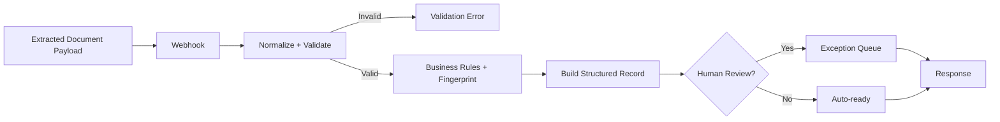

# Intelligent Document Operations

> Production-minded portfolio reference implementation for document intake, structured field validation, business-rule checks, exception routing, and downstream-ready records.

**Author:** Tetiana Shtemberh  
**Role:** AI Automation & Implementation Specialist  
**Stack:** n8n · JavaScript · Webhooks · JSON · Document Processing · AI/LLM-ready · Human-in-the-loop

---

## Business Problem

Operational teams receive invoices, purchase documents, forms, and other business records that must be checked and converted into structured data before they enter finance, ERP, CRM, or approval workflows.

Manual processing creates repetitive data entry, inconsistent validation, duplicate risk, and slow exception handling.

This reference implementation demonstrates a document-operations pipeline that accepts extracted document content, normalizes and validates it, applies business rules, identifies exceptions, and produces a downstream-ready record.

---

## System Flow

**Extracted Document Payload → Webhook → Normalize & Validate → Business Rules → Fingerprint → Structured Record → Human Review / Auto-ready → Response**

---

## Architecture

---

## Implemented in the Workflow

- webhook document-data intake
- field normalization
- required-field validation
- supported document-type validation
- invoice arithmetic verification
- due-date and amount checks
- deterministic document fingerprint
- downstream-ready structured record
- explicit exception reasons
- human-review routing
- controlled invalid-request response

The tested core is deterministic and requires no paid API.

---

## Document Processing Model

This workflow starts from an **extracted document payload** rather than claiming OCR on binary files.

| Document Type | Reference Processing |
|---|---|
| `INVOICE` | supplier, reference, dates, currency, subtotal/tax/total, arithmetic checks |
| `PURCHASE_ORDER` | supplier, reference, date, currency, total |
| `FORM` | reference, date, source metadata |

A production ingestion layer can connect OCR/document-AI, email attachments, cloud storage, or ERP sources.

---

## AI Integration Strategy

The workflow is **AI/LLM-ready**, but no external AI service is claimed as implemented in the tested core.

A production AI/document-intelligence layer can provide OCR, document classification, field and table extraction, normalization, and confidence scores. Deterministic validation and human-review rules remain valuable after AI extraction.

---

## Business Rules

For invoice documents, the reference implementation checks:

- required supplier and invoice identifiers
- valid positive total
- `subtotal + tax ≈ total`
- due date relative to issue date
- high-value threshold
- extraction-confidence threshold when provided

---

## Human-in-the-loop

Human review is required when invoice arithmetic does not reconcile, the reference high-value threshold is reached, the due date precedes the issue date, or extraction confidence is low.

The workflow does not automatically approve financially sensitive exceptions.

---

## Demo & Evidence

Evidence screenshots will be added **after** the workflow is imported and tested in n8n.

Planned evidence:

1. complete workflow architecture
2. clean invoice → auto-ready execution
3. exception invoice → human-review execution
4. invalid document → controlled rejection

---

## Reliability Considerations

**Implemented in the workflow:**

- input normalization and validation
- deterministic document fingerprinting
- arithmetic/business-rule checks
- explicit exception reasons
- controlled success and error responses
- human-review gate

**Documented for production deployment:**

- binary file ingestion and OCR/document-AI integration
- persistent idempotency and duplicate prevention
- retries and rate-limit handling
- structured execution logging and failure alerting
- confidence-based AI fallback strategy

---

## Portfolio Status

**Reference implementation — ready for n8n validation**

Built with synthetic document data and mock credentials. No client documents, production secrets, or private infrastructure are included.

---

## Demonstrated Skills

`n8n` · `JavaScript` · `Webhooks` · `JSON` · `Document Processing` · `Data Validation` · `Business Rules` · `Deduplication` · `Exception Routing` · `Human-in-the-loop` · `AI Integration Design` · `Failure Handling` · `Documentation`

---

## Author

**Tetiana Shtemberh**  
AI Automation & Implementation Specialist  
Gdańsk, Poland · 100% Remote — EU / Worldwide
